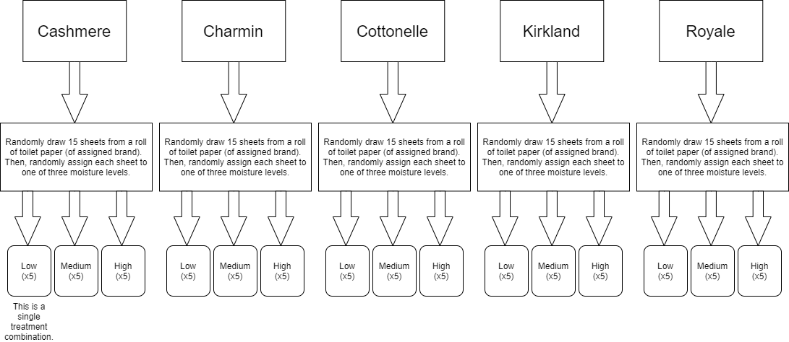
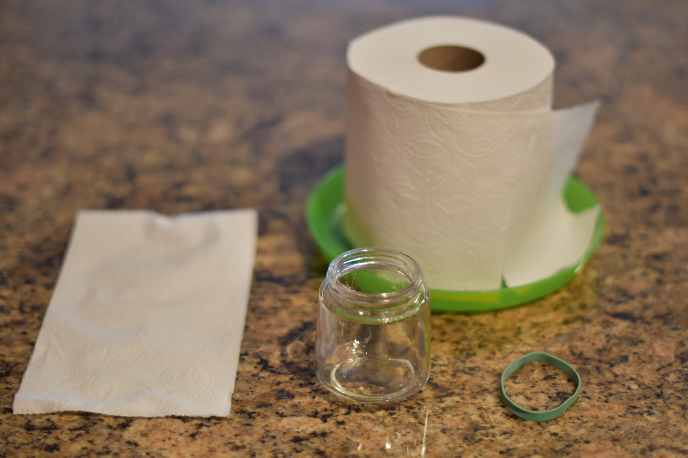
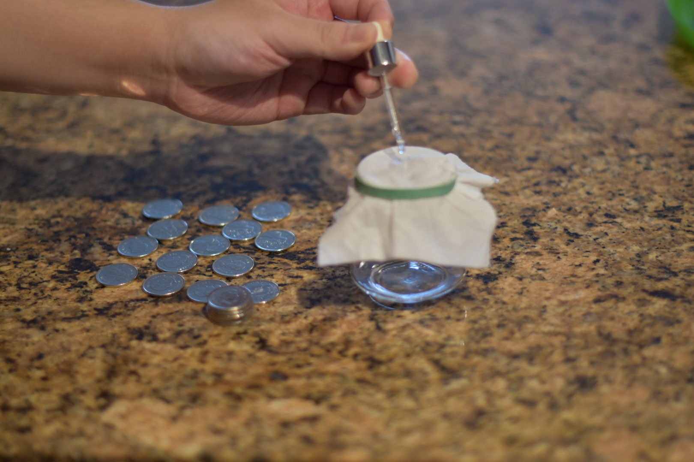
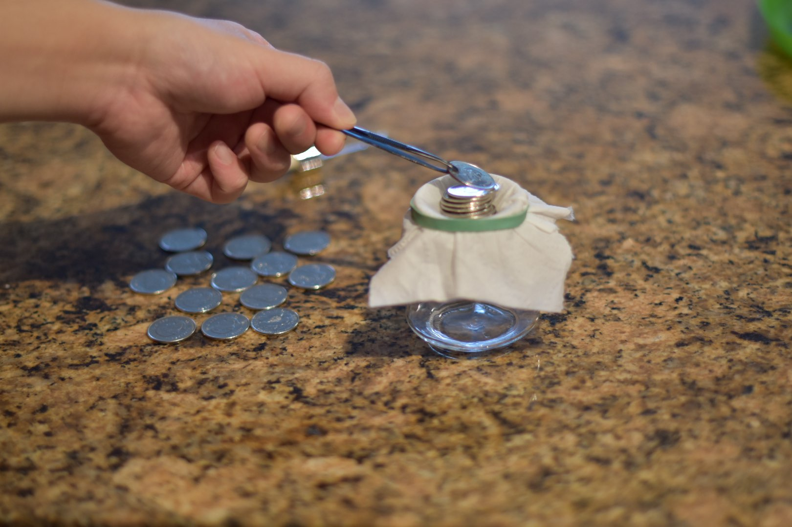

\titlespacing{\section}{0pt}{12pt plus 2pt minus 1pt}{0pt plus 1pt minus 1pt}
\titlespacing{\subsection}{0pt}{12pt plus 2pt minus 1pt}{0pt plus 1pt minus 1pt}
\titlespacing{\subsubsection}{0pt}{12pt plus 2pt minus 1pt}{0pt plus 1pt minus 1pt}

```{r setup, include=FALSE}
knitr::opts_chunk$set(echo = TRUE)
knitr::opts_chunk$set(fig.pos = 'H')
options(knitr.table.format = "pipe")

# Required packages
library(pwr2)
library(tidyverse)
library(broom)
library(xtable)
library(knitr)

# Function to format the ss.2way table.
# SOURCE FROM https://rdrr.io/github/billdenney/bsd.report/src/R/as.data.frame.power.htest.R
as.data.frame.power.htest <- function(x, ..., digits=3) {
  value <-
    sapply(
      X=x,
      FUN=function(y) {
        if (is.numeric(y)) {
          as.character(signif(y, digits=digits))
        } else if (is.null(y)) {
          # one-sample tests have a NULL note value
          "(none)"
        } else {
          y
        }
      }
    )
  data.frame(
    Parameter=
      dplyr::recode(
        names(x),
        n="N",
        sd="SD",
        sig.level="Significance Level",
        power="Power",
        alternative="Alternative",
        note="Note",
        method="Method"
      ),
    Value=
      dplyr::recode(
        unname(value),
        one.sided="One-sided",
        two.sided="Two-sided"
      ),
    stringsAsFactors=FALSE
  )
}

# Function to convert fitted model to df with convenient col/rownames
model_to_df <- function(model) {
  df <- tidy(model) %>% as.data.frame
  
  # Use cleaned predictors names as dataframe row names
  varnames <- df$term %>% 
    lapply(function(x) gsub("[^A-Za-z0-9]", "", x)) # keep only alphanumeric chars in row names
  rownames(df) <- varnames
  df$term <- NULL
  return(df)
}

# Function to add useful terms to a named list with its model.
gen_model_summaries <- function(vec) {
  # Pull out useful values from model summaries to data frame and to vec scope
  vec$dataframe <- model_to_df(vec$model)
  vec$modelsummary <- summary(vec$model)
  vec$anovatable <- anova(vec$model) %>% as.data.frame
  
  return(vec)
}

# Loading in the data 
toiletPaperData <- read.csv("toilet_paper_data.csv") 

# Force an order for the data variables
toiletPaperData$moisture <- factor(toiletPaperData$moisture, levels=c("low", "medium", "high"))

attach(toiletPaperData)
```

```{r model-fitting, echo=FALSE}
# Model with interaction
int <- list(model=lm(coins ~ brand * moisture))

# Pull out useful values from model summaries to data frame and to object scope
int <- gen_model_summaries(int)

# Additive Model: model with main effects only
additive <- list(model=lm(coins ~ brand + moisture))

# Pull out useful values from model summaries to data frame and to object scope
additive <- gen_model_summaries(additive)
```

# Description of Case Study

Toilet paper is one of the top essential personal hygiene products of the century. It is widely used throughout western culture, namely in Canada. Consumer demand and market expansion for toilet paper have lead to the establishment of many brands with only a few claiming the majority of the market share. Good toilet paper is usually determined by its durability after absorbing liquids. We want to take a deeper look into the various popular toilet paper brands in Canada and see which brand offers the strongest toilet paper after exposure to various levels of moisture. Consequently, we want to devise an experiment to answer the question, "Does the brand of toilet paper and amount of liquid absorbed have an effect on its durability?". The target population would be popular 2-ply toilet paper brands in Canada and the experimental unit would be a single square piece of 2-ply toilet paper. The results of this case study will allow us to understand the effects of brand and consumer usage on the credibility of the product. 

# Description of Experimental Design

## Variables

The response variable of interest is the maximum number of coins that the wet toilet paper can support before it breaks in each trial. It is a numerical, interval variable.

We have two predictor variables:

1) Toilet paper brand $(A, B, C, D, E)$ for (Cashmere, Charmin, Cottonelle, Kirkland, Royale) respectively. It is a factor (categorical predictor) with 5 levels.
2) The amount of water applied to the toilet paper $(J, K, L)$ for (Low, Medium, High), respectively. It is also a factor (categorical variable) that describes the amount of water that was applied to the toilet paper, with 3 levels: Low = 0.5mL, Medium = 1.0mL, High = 1.5mL.

We treat Cashmere and the Low moisture level as the baseline level, and cross the two factors, resulting in $5\times 3=15$ different treatments. We conduct each treatment 5 times (justification for sample size is in the Data Analysis section), which gives us a grand total of $15\times 5=75$ samples. Since there is an even number of observations at each treatment combination, we have a complete (crossed) and balanced design. Furthermore, this experiment is a between-subjects design because the experimental unit (the single sheet of toilet paper) becomes ineffective after undergoing a single treatment.

As a side note, we did not consider any placebo treatment, control groups, or blindness as there are no psychological drawbacks in this experiment.

## Procedure

We initialized a rigorous procedure to make sure there were constant, unchanging factors:

Materials needed: A glass cup exactly 5 cm in diameter, rubber band, quarters (made in 2000 and onward because composition of coins are different), a syringe, water, and toilet paper from a specific brand.

A diagram explaining the experiment procedure can be found in Figure \@ref(fig:exp-procedure), and a photo of the overall experiment is in Figure \@ref(fig:exp-procedure-1).

1. Carefully rip out all the sheets of toilet paper from the roll, making sure that none are damaged. Then, randomly select 15 of these sheets.

2. Take a single sheet of toilet paper and place it over the cup, fastening it in place with a rubber band (Figure \@ref(fig:exp-procedure-2)).

3. Administer the previously determined amount of water using a syringe to the toilet paper.

4. After 5 seconds, place a coin on the center of the paper. If the coin does not tear and fall through the paper, wait another 5 seconds and place another coin. Continue waiting for 5 seconds and placing coins until the paper tears apart (Figure \@ref(fig:exp-procedure-3)).

5. Record the number of coins needed to tear through the paper. Conduct the experiment 5 times for each factor (moisture) level of water (0.5ml, 1ml, 2ml), and repeat steps 2-5 until all trials have been completed.


## Experiment Principles

To begin, there were many uncontrollable factors throughout the experiment, such as surrounding humidity, room temperature, and exact water temperature. These factors will be neutralized and taken into consideration by the randomization principle. However, there were plenty of other variables that we controlled for. These included: cup size (exactly 5 cm in diameter), the coins we used, the type of rubber band we used to fasten the toilet paper sheet in place, the method and initial force of placing a coin on the wet toilet paper, the syringe we used to administer water, the type of bathroom tissue (we only looked at 2-ply), and the time between applying water and dropping coins on the toilet paper. 

We did not use blocking because we are primarily interested in the toilet paper brands themselves. Since we controlled most of the nuisance variables, we instead opt for a completely randomized (CR) design.

Next, because we did not utilize blocking, randomization becomes a key principle in our experiment. We rip off all the toilet paper sheets from a roll, take a random sheet from that pile, and randomly assign them to a moisture level in order to reduce confounding. Figure \@ref(fig:exp-procedure) illustrates the random assignment of the experimental units. In addition to this, we will assume that a toilet paper sheet from a random toilet paper roll (from a random pack of bathroom tissue) is representative of that brand to allow for valid inferences made later on in the experiment.

Finally, in terms of replication, we replicate at the *treatment* level 5 times per treatment to ensure that the resulting effects are not due to the experimental unit. Furthermore, this better allows us to estimate experimental error.

# Data Analysis

## Sample Size Determination

The sample size for this experiment was calculated using the `ss.2way` function from the `pwr2` R package; the corresponding output is in Table \@ref(tab:samp-size). The function takes as input the number of groups in each factor, significance level chosen for the hypothesis test, desired power, and the effect sizes for the factors. The number of groups was set to 5 for the brand factor (Cashmere, Charmin, Cottonelle, Kirkland, Royale), and 3 in the moisture factor (Low, Medium, high). The significance level chosen for the hypothesis test is $0.05$. Since the purpose of this study was to understand the properties of various toilet paper products and inform future consumer choice, the ability to replicate the findings of this study is a key objective. As a result, a high power is necessary as it corresponds to a low probability of Type II error. Thus, the power was set to 0.8, or 80%. And finally, in order to "fine tune" the experiment such that even relatively small effect gets detected, the effect size for each factor was set to 0.25. Our end result for the sample size calculations tell us that each factor level must have 5 units assigned, which means our total sample size is 75.

## Two-Way ANOVA

The first step of our two-way ANOVA analysis is the determine if there is a significant interaction effect between the two factors (brand and moisture). From the interaction plot seen in Figure \@ref(fig:interaction-plot) we observed mostly parallel lines, except for cashmere having a significant higher mean (# of coins) under low moisture relative to when under medium and high moisture level. This implies minimal interaction effect between the two factors, so we fitted the interaction model and formally tested the interaction effect with ANOVA F-test (see Tables \@ref(tab:int-model-summary) and \@ref(tab:int-anova-table)). From the ANOVA table we obtained a p-value of 0.38, which implies that we do not have significant evidence for the existence of an interaction effect between the two factors. And together with the interaction plot (Figure \@ref(fig:interaction-plot)), we concluded that there is no significant interaction effect between the toilet paper brands and the moisture
levels on the number of coins that the toilet paper can support, and we proceed to fitting a reduced additive model with just the main effects as our final model.

Observing the additive model summary (Table \@ref(tab:add-model-summary)), we see that on average, Cashmere can support up to 15 coins before tearing, regardless of moisture level. There is not enough evidence to say anything about Charmin, Royale and Cottonelle compared to the baseline, but Kirkland was deemed statistically significant to conclude that it can support an additional 6-7 coins more than Cashmere (while keeping moisture constant). Finally, for our second factor, it is clear that moisture levels affect the number of coins supported; in fact, we have strong evidence to deduce that the average number of coins held by the sheet of toilet paper decreases by roughly 3 coins and 7 coins for the `medium` and `high` moisture levels respectively.

From the ANOVA table of the additive model (Table \@ref(tab:add-anova-table)), we obtained two extremely small p-values ($<.000001$) that are well below the 5% significance level, which provides strong evidence that both brand and moisture level have a statistically significant effect on the # of coins supported when the other respective factor is controlled for.

## Tukey's HSD Post-Hoc Analysis
```{r tukey-hsd-table, echo=FALSE}
# Refit model with coded nmes for our plots to save space

dataCpy <- data.frame(toiletPaperData)
dataCpy$brand <- dataCpy$brand %>% as.factor
levels(dataCpy$moisture) <- c("J", "K", "L")
levels(dataCpy$brand) <- c("A", "B", "C", "D", "E")
newAdditive <- list(model=with(dataCpy, lm(coins ~ brand + moisture)))
newAdditive$tukey <- newAdditive$model %>% aov %>% TukeyHSD
newAdditive$tukey %>% 
  tidy %>% 
  setNames(colnames(.) %>% lapply(function(x) gsub("\\.", " ", x))) %>% 
  kable(caption="Tukey's HSD Confidence Interval Plot")
```

```{r tukey-hsd-plot, fig.cap="Tukey's HSD Confidence Interval Plot", fig.height=4, echo=FALSE, warning=FALSE}
par(mfrow=c(1, 2), cex.main=0.98)
newAdditive$tukey %>% plot(cex.axis=1, cex.names=.5, las=2) 
```

To determine if the mean difference between specific pairs of groups are statistically significant, we shift our attention to Tukey's HSD. Table \@ref(tab:tukey-hsd-table) shows us the mean difference estimates of all pairs of each factor level, along with their confidence intervals and p-values. The coding for the factor levels in these contrasts were described in Section 2.1. 

Looking only at the confidence intervals in \@ref(fig:tukey-hsd-plot) without 0 and the p-values less than our benchmark significance level, we see that $D-A, D-B, D-C, E-D$, and all the moisture contrasts are significant. It is notable that $D$ (Kirkland) appears in all these significant contrasts; each pair has positive estimates (except $E-D$, since Kirkland's estimate is being subtracted from Royale's), making it a strong contender for durable toilet paper brands since it can hold more coins than any other brand on average. Hence, we reject $H_{0}$, affirming that the mean difference of coins supported between Kirkland and any other brand is non-zero, and its difference lays in each respective interval with 95% confidence.

Finally, each pair of moisture levels is also statistically significant, so we can conclude that the mean difference of coins supported for each pairwise comparison is also non-zero (holding brand constant).

# Other Relevant Information

It is no surprise that a human executed experiment will have some degree of human error. During data collection, we found that there was difficulty keeping the coins balanced on top of each other. This in theory varied the amount of pressure induced by the coins on the toilet paper between each trial, as well as which points of the toilet paper experienced more force. In addition, we also found that during some of the trials for the medium and especially the high moisture levels, some of the water would not get absorbed by the toilet paper and leak through into the cup. This directly varies the amount of water absorbed by the toilet paper that was supposed to be held constant. 

# Limitations

A major limitation of our design is the sample. Since we are only experimenting on the top toilet paper brands in Canada, our results cannot be extrapolated to all toilet paper. As such, our target population is limited to only toilet paper brands in Canada. A simple improvement to this would be conducting the experiment again with toilet paper brands from various countries in the world. For reducing human error in our data collection, we can design a rig to place the coins in the exact spot with the same amount of force each time. 

# Conclusion

In the final analysis, both moisture level and brand affect the durability of toilet paper. With this in mind, we found that all the moisture levels are statistically significant holding brand constant, but not all brands are statistically significant holding moisture level constant. More specifically, while holding moisture level constant, we found that the Kirkland brand was supporting on average an additional 6-7 coins more than the brand default, Cashmere. Furthermore, by comparing individual pairs of brands, we also found that the pairs with the Kirkland brand have a greater average difference than other pairs. Hence, we conclude that the Kirkland brand of toilet paper is more durable on average compared to the other brands.

To answer our question of interest, it is clear that regardless of moisture level, the durability of toilet paper is dependent on its brand. This tells us that even though the same product is being created by different brands, they are not created equal. Also, it is important to notice that even though the brands we have selected for our study were popular Canadian brands, there was a variation in quality. That is to say, we can deduce that quality is independent of brand popularity. Ultimately, consumers should consider the quality of a product over the brand that is producing it. 

\newpage

# Appendix

## Tables and Plots

{#fig:exp-procedure}

```{r exp-procedure-1, echo=FALSE, out.width="50%", fig.align="center", fig.cap="Experiment Overview"}

```

```{r exp-procedure-2, echo=FALSE, out.width="50%", fig.align="center", fig.cap="Applying water to the toilet paper"}

```

```{r exp-procedure-3, echo=FALSE, out.width="50%", fig.align="center", fig.cap="Adding coins on the wet toilet paper"}

```


```{r interaction-plot, fig.height=4, fig.cap="Interaction Plot for Brand and Moisture", echo=FALSE}
interaction.plot(brand, moisture, coins,
                 col=c("cyan", "blue", "darkorchid1"),
                 lty=2,
                 lwd=2,
                 xlab="Brand Mean",
                 ylab="Number of Coins",
                 main="Interaction Plot")
```

```{r samp-size, echo=FALSE}
sample_size_calc <- ss.2way(a=5, b=3, alpha=0.05, beta=1-0.8, f.A=0.25, f.B=0.25, B=4)
sample_size_calc %>% as.data.frame.power.htest %>% kable(caption="Sample size computation")
```

\bigskip

Interaction + main Effect Model:
\begin{align*}
    E(Y_i) = \beta_{0} &+\underbrace{\beta_1I_{B,i} +\beta_2I_{C,i} + \beta_3I_{D,i} + \beta_4I_{E,i}}_{\text{Terms for brands}} \\
                     &+\underbrace{\beta_5I_{K,i} +\beta_6I_{L,i}}_{\text{Terms for water applied}} \\
                     &+\underbrace{\beta_7(I_{B,i}\times I_{K,i}) +\beta_8(I_{B,i}\times I_{L,i})}_{\text{Charmin-(Med/High) ITs}} +\underbrace{\beta_9(I_{C,i}\times I_{K,i}) +\beta_{10}(I_{C,i}\times I_{L,i})}_{\text{Cottonelle ITs}} \\
                     &+\underbrace{\beta_{11}(I_{D,i}\times I_{K,i}) +\beta_{12}(I_{D,i}\times I_{L,i})}_{\text{Kirkland-(Med/High) ITs}} +\underbrace{\beta_{13}(I_{E,i}\times I_{K,i}) +\beta_{14}(I_{E,i}\times I_{L,i})}_{\text{Royale-(Med/High) ITs}}+\epsilon_i
\end{align*}

\begin{align*}
  H_0 &: \beta_7 = \beta_8 = \beta_9 = \beta_{10} = \beta_{11} = \beta_{12} = \beta_{13} = \beta_{14} = 0 \\
  H_A &: \text{at least one } \beta_i\neq 0 \text{ for } i\in\{7,\dots,14\}
\end{align*}

```{r int-model-summary, echo=FALSE}
int$modelsummary %>% xtable %>% kable(caption="Interaction Model Summary")
```
\bigskip
```{r int-anova-table, echo=FALSE}
int$anovatable %>% xtable %>% kable(caption="Interaction Model ANOVA Table")
```
\bigskip
\bigskip

Additive Model with only main effect:
\begin{align*}
    E(Y_i) = \beta_{0} &+\underbrace{\beta_1I_{B,i} +\beta_2I_{C,i} + \beta_3I_{D,i} + \beta_4I_{E,i}}_{\text{Terms for brands}} \\
                     &+\underbrace{\beta_5I_{K,i} +\beta_6I_{L,i}}_{\text{Terms for water applied}} +\epsilon_i
\end{align*}

* Brand Effect
\begin{align*}
  H_0 &: \beta_1 = \beta_2 = \beta_3 = \beta_{4} = 0 \\
  H_A &: \text{at least one } \beta_i\neq 0 \text{ for } i\in\{1,\dots,4\}
\end{align*}
* Moisture Effect
\begin{align*}
  H_0 &: \beta_5 = \beta_6 = 0 \\
  H_A &: \text{at least one } \beta_i\neq 0 \text{ for } i\in\{5,6\}
\end{align*}

\bigskip

```{r add-model-summary, echo=FALSE}
additive$modelsummary %>% xtable %>% kable(caption="Additive Model Summary")
```
\bigskip
```{r add-anova-table, echo=FALSE}
additive$anovatable %>% xtable %>% kable(caption="Additive Model ANOVA Table", digits=10)
```

\bigskip

## R Code

### Sample size calculation
```{r eval=FALSE}
sample_size_calc <- ss.2way(a=5, b=3, alpha=0.05, beta=1-0.8, f.A=0.25, f.B=0.25, B=4)
```

### Interaction plot
```{r eval=FALSE}
interaction.plot(brand, moisture, coins,
                 col=c("cyan", "darkorchid1", "blue"),
                 lty=2,
                 lwd=2,
                 xlab="Brand Mean",
                 ylab="Number of Coins")
```

### Model generation

```{r eval=FALSE}
# Function to convert fitted model to df with convenient col/rownames
model_to_df <- function(model) {
  df <- tidy(model) %>% as.data.frame
  
  # Use cleaned predictors names as dataframe row names
  varnames <- df$term %>% 
    lapply(function(x) gsub("[^A-Za-z0-9]", "", x)) # keep only alphanumeric chars in row names
  rownames(df) <- varnames
  df$term <- NULL
  return(df)
}

# Function to add useful terms to a named list with its model.
gen_model_summaries <- function(vec) {
  # Pull out useful values from model summaries to data frame and to vec scope
  vec$dataframe <- model_to_df(vec$model)
  vec$modelsummary <- summary(vec$model)
  vec$anovatable <- anova(vec$model) %>% as.data.frame
  
  return(vec)
}

# Loading in the data & attaching col vectors to global scope, rename "some" -> "medium"
toiletPaperData <- read.csv("toilet_paper_data.csv") %>%
  mutate(moisture = str_replace(moisture, "some", "medium"))
  replace("some", "medium")
attach(toiletPaperData)

# Force an order for the data variables
toiletPaperData$moisture <- factor(toiletPaperData$moisture, levels=c("low", "medium", "high"))

# Model with interaction
int <- list(model=lm(coins ~ brand * moisture))

# Pull out useful values from model summaries to data frame and to object scope
int <- gen_model_summaries(int)

# Additive Model: model with main effects only
additive <- list(model=lm(coins ~ brand + moisture))

# Pull out useful values from model summaries to data frame and to object scope
additive <- gen_model_summaries(additive)

```

### Assessing Model Assumptions
```{r eval=FALSE}
# Assessing independence of the error terms using residual vs fitted plots
par(mfrow=c(1, 2))
plot(int$model, which = 1, main="Interaction Model")
plot(additive$model, which = 1, main="Additive Model")

# Assessing identical distribution of the error terms using scale-location plots
par(mfrow=c(1, 2))
plot(int$model, which=3, main="Interaction Model")
plot(additive$model, which=3, main="Additive Model")

# Assessing normality of the error terms using QQ plots
par(mfrow=c(1, 2))
plot(int$model, which=2)
plot(additive$model, which=2)

# Assessing normality of the error terms using Shapiro-Wilk tests
int$resid <- residuals(object = int$model)
additive$resid <- residuals(object = additive$model)
data.frame(
  Interaction=shapiro.test(int$resid) %>% tidy %>% select(-method),
  Additive=shapiro.test(additive$resid) %>% tidy %>% select(-method)
) %>%
  setNames(colnames(.) %>% lapply(function(x) gsub("\\.", " ", x))) %>% 
  kable(caption="Interaction and Additive Model Shapiro-Wilk Tests")
```

## Raw Data
```{r echo=FALSE}
options(knitr.kable.NA = '')
dataRows <- seq_len(ceiling(nrow(toiletPaperData) / 2))
data.frame(
  toiletPaperData[dataRows, 1:3],
  lapply(toiletPaperData[-dataRows, 1:3], `length<-`, ceiling(nrow(toiletPaperData) / 2))) %>% 
  `colnames<-`(rep(c("Brand", "Moisture", "Coins"), 2)) %>%
  kable(row.names=FALSE, format="simple")
```